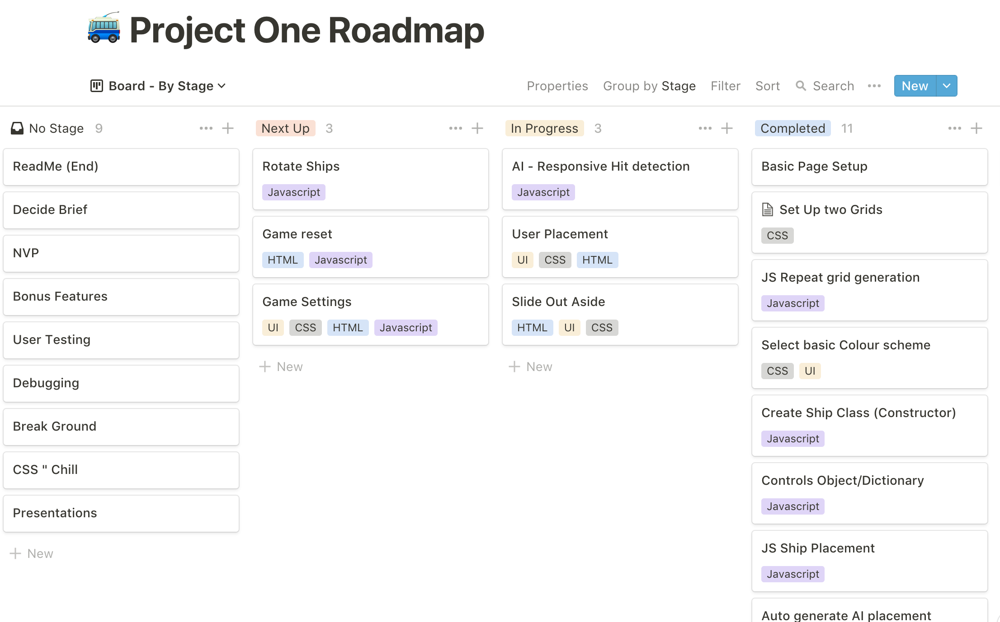

# **SEI-Project-1**

Vanilla JavaScript Game

[Link to Play Battleships](https://lifearoundhere.github.io/Battleships-Game/)

**Timeframe**: 7 days solo project

- Technologies used
- JavaScript (ES6)
- HTML5
- CSS
- git
- Minor techs (HTML5 Audio, CSS animation, localStorage etc)

## **Installation**

Clone or download the repo

Open the index.html in your browser of choice

## **Overview**

The brief was to build battleship using vanilla  JavaScript. The concept required it to be able to take a turn once the player has taken a turn and for the player to be able to place ships on their board.

## **Process**

I started with the planning phase by building a Kanban Roadmap within Notion (a note-taking and collaboration application like Evernote).  I created cards for each of the challenges that I felt I would face allowing me to break down the large project into a list of smaller tasks.  Effectively each task became a function or feature. 




I first started by building a dictionary objects with a list of all the ships and then a constructor class to build my ships for me when called. I then built a mockup of what I thought my HTML needed to entail using  CSS grid. Once satisfied that I had the main double elements that are needed to call to allow me to start building out more of my JavaScript.  I then built a loop to add each of the cells, which would become the clickable divs for the user.  I eventually built a grid constructor class because I felt that it would reduce the amount of repeatable code. As there are two grids that need to be produced and reset simultaneously, and only a divergence of a few procedural functions for each depending on whether not the CPU or the player would control it.  

```javascript
class Ship {
  constructor(height, width, name, cssClass) {
    this.name = name
    this.height = height
    this.width = width
    this.cssClass = cssClass
    this.yaxis = function(){
      return [this.height, this.width] = [this.width, this.height]
    }
  }
}

const allShipType = {
  Destoryer: [1, 2, 'Destoryer','destoryerCss'],
  Submarine: [1, 3, 'Submarine','submarineCss'],
  Cruiser: [1, 3, 'Cruiser','cruiserCss'],
  Battleship: [1, 4, 'Battleship','battleshipCss'],
  Carrier: [1, 5, 'Carrier','carrierCss']
}
```


While building each of the stages required to build base functionality;  I found that the code became ever increasingly staggered and unnecessarily complicated. As there were too many variables, I was quite often plagued during this project by the thought that there must be a more straightforward way of doing this, which I was not doing.

During the end of the project, I many focused on CSS and user testing and debugging.  I found a lot my bugs through testing the game myself. Often I had not thought of user behaviours, so had not built code to anticipate misclicks and another erroneous user input.

This kept pushing me into the state of using horrendous if statements to deal with the new  Edge cases that built from unanticipated variables or results.  I found the CSS quite enjoyable allowed me to play around with sidebars and modals. Though I found myself limited in the theme, I found a variety by being quite playful with CSS animations.

## **Challenges**

Querying the DOM at the beginning was quite arduous as I often had to deal with being surprised act receiving an HTML collection or Dom tokens upon querying the DOM instead of a node list.  I learnt through trial & error; however, I felt that if I were to do this again, I would plan out my queries and what I plan to do that data in detail before writing any code again.

I found the concept of developing an algorithm to play against the player quite arduous simply because it was a staggering set of a dozen edge cases that needed to be coded if the CPU what's to play the game as a person would. However, this produces a CPU player who is very novice at trying to win the game and when you're using procedural code to find the players battleships.  I found that it would produce code that was not scalable in difficulty. It almost seemed more logical to have the CPU  player cheat as it would produce a game of reasonable difficulty level. If I was to do this again, I think I would start by producing a searching algorithm that I could scale to be a more dynamic opponent.

I also jumped from paradigm to paradigm from object-oriented to functional to procedural code. I felt that this produced a very incoherent codebase.  I should have stuck with purely functional for now.

## **Wins**

The wins were the sense of accomplishment and the chance to play about with features within CSS HTML JavaScript that I have not played about with before. This was an open-book challenge, and I enjoyed the trial-and-error of attempting multiple ways to get to the same results.  I think quite often we as people get locked into the idea of the best way; however, there are many ways to get something done.

I liked the design at the end and was quite satisfied with my dictionary functionality as I felt that made the code more dynamic if changes were made in the future.

I enjoyed styling with CSS and javascript, which allowed me to get creative with a dynamic loading page.


## **Future features**

Future feature to add is an easy, normal and hard mode for the game with a scalable searching algorithm as the primary function driving the CPU players manoeuvres.  I would add dragged and droppable divs instead of using buttons as I would feel that it would be more responsive and turns of UX. I also think something like this in the future would be great as a progressive web app as I get further into my Bootcamp course. I am very much looking forward to the back-end technologies.

